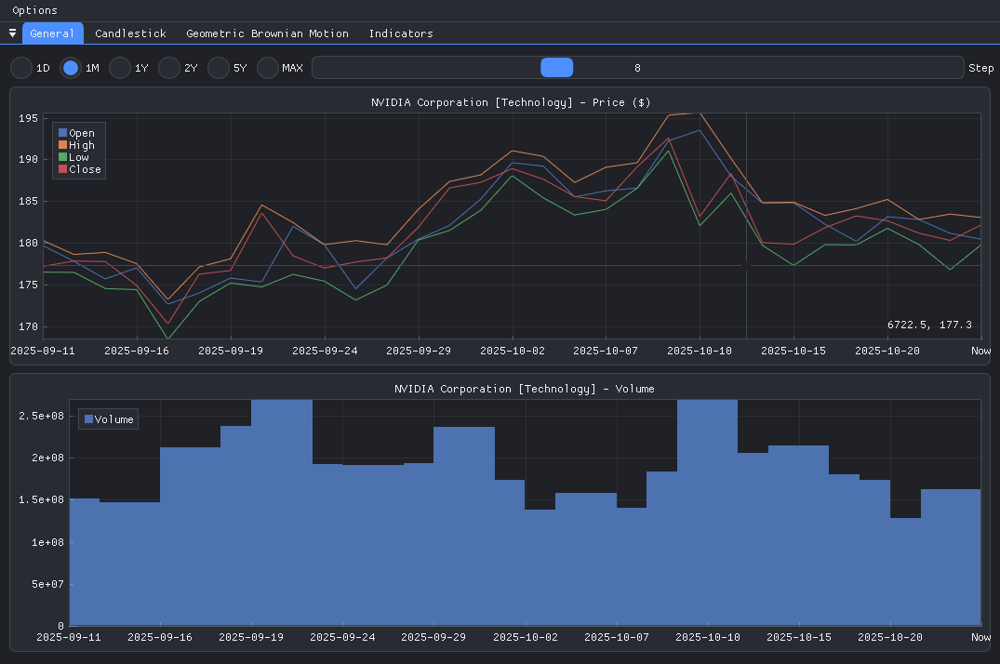

# Quant

This program is a quantitative trading platform that provides advanced tools for market analysis and financial modeling. It displays detailed financial charts, including open, low, high, close, and volume data, as well as Japanese candlestick diagrams with automatic pattern recognition.

In addition to visualization, the program can solve stochastic differential equations, such as the Geometric Brownian Motion, enabling realistic modeling of asset price dynamics. It also includes a wide range of technical indicators for trend detection, volatility measurement, and signal generation, making it suitable for both quantitative research and algorithmic trading.

